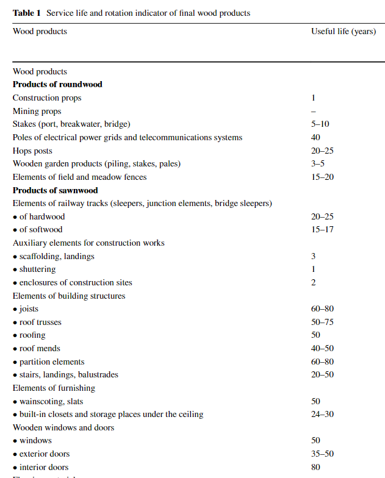
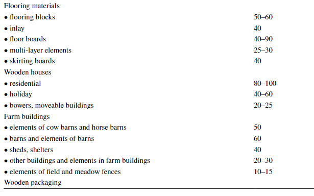
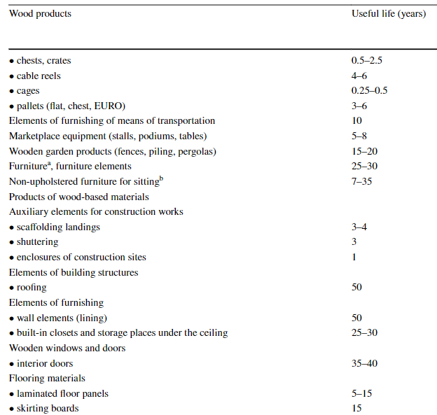
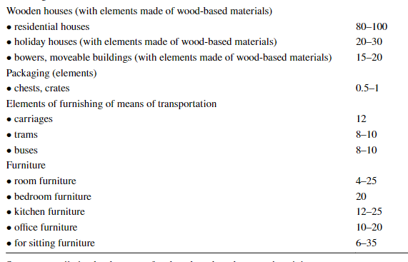
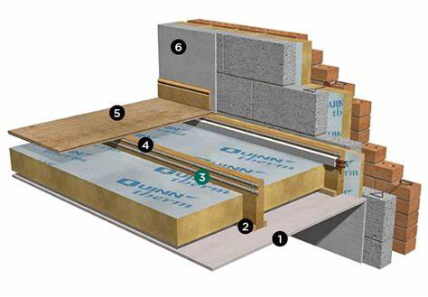

---
jupytext:
  text_representation:
    extension: .md
    format_name: myst
    format_version: 0.13
    jupytext_version: 1.13.8
kernelspec:
  display_name: Python 3 (ipykernel)
  language: python
  name: python3
---

```{code-cell} ipython3
from rdflib import Namespace
from sankey_helpers import show_skeleton
from sankey_helpers import guess_elements, guess_and_show, resolve_and_show_elements
SYS = Namespace("http://ukfires.org/analyses/UK-wood/system/")
```

# Main object types

These definitions are taken from FAO: 
- <https://www.fao.org/forestry/34572-0902b3c041384fd87f2451da2bb9237.pdf?msclkid=fea74627d04711ecbd9cfa4c9491bef5> 
- <https://www.fao.org/forestry/statistics/80572/en/>

And from the Forest research statistics: 
- <https://cdn.forestresearch.gov.uk/2022/02/complete_fs2021_jvyjbwa.pdf>

The following list enumerates exhaustively all the final wood products made out of roundwood or sawnwood. 
**Source**: Ratajczak, E., A. Szostak, G. Bidzińska & M. Herbeć (2017) Potential resources of post-consumer wood waste in Poland. Journal of material cycles and waste management, 20, 402-413.


 
 

  


## Roundwood

Deliveries data is used for roundwood. Deliveries relate to the quantity of UK-grown and imported roundwood that is 
delivered to processors (mills) or for other uses (such as woodfuel and exports). 
They are expressed in green tonnes (weight when freshly felled). 
Deliveries should not be confused with removals, which are the quantities of 
roundwood that is harvested from UK woodland.

Green tonnes are converted to tonnes using the following coinversion table: 
<https://www.forestresearch.gov.uk/tools-and-resources/statistics/forestry-statistics/forestry-statistics-2018/sources/timber-2/conversion-factors/>

**Process input** to SawmillsSoftwood, SawmillsHardwood, WBP manufacturing, Pulpmills, BioenergyPlant, Wood pellets manufacturing and Fencing manufacturing.

```{system:object} Roundwood
:become_parent: true
```

```{system:object} SoftwoodRoundwood
:label: Softwood
Softwood refers to wood coming from coniferous trees.
```

```{system:object} HardwoodRoundwood
:label: Hardwood

Hardwood refers to wood coming from non-coniferous trees.
```

```{end-sub-objects}
```

## Semi-finished products

```{system:object} SemiFinishedProducts
:become_parent: true
```

### Sawnwood 

Defition from FAO: 
:Wood that has been produced from both domestic and imported roundwood, either 
by sawing lengthways or by a profile-chipping process and that exceeds 6 mm in 
thickness. 
- **It includes** planks, beams, joists, boards, rafters, scantlings, laths, 
boxboards and "lumber", etc., in the following forms: unplaned, planed, end-jointed 
(for example finger-jointed), etc. 
- **It excludes** sleepers, wooden flooring, mouldings 
(sawnwood continuously shaped along any of its edges or faces, like tongued, 
grooved, rebated, V-jointed, beaded, moulded, rounded or the like) and sawnwood 
produced by resawing previously sawn pieces. 

```{system:object} Sawnwood
:become_parent: true
```

```{system:object} SoftwoodSawnwood
:label: Softwood Sawnwood
```

```{system:object} HardwoodSawnwood
:label: Hardwood Sawnwood
```

```{end-sub-objects}
```


### WBP products

The definitions for these WBP products come from FAO.


```{system:object} WBPFibres
:label: WBP Fibres
Fibre mixes used for making wood-based panels. 
```

```{system:object} WBPproducts
:become_parent: true
```

```{system:object} Fibreboard
:label: Fibreboard

A panel manufactured from fibres of wood or other ligno-cellulosic materials with the 
primary bond deriving from the felting of the fibres and their inherent adhesive 
properties (although bonding materials and/or additives may be added in the 
manufacturing process). 
- **It includes**  medium/high density fibreboard (MDF/HDF) and other fibreboard. 
```

```{system:object} Particleboard
:label: Particleboard

A panel manufactured from small pieces of wood or other ligno-cellulosic materials 
(e.g. chips, flakes, splinters, strands, shreds, shives, etc.) bonded together by the use 
of an organic binder together with one or more of the following agents: heat, 
pressure, humidity, a catalyst, etc. 
- **It includes** oriented strandboard (OSB), medium density particle board 
(MDP), waferboard and flaxboard. 

```

```{system:object} VeneerSheets
:label: Veneer sheets

Thin sheets of wood of uniform thickness, not exceeding 6 mm, rotary cut (i.e. 
peeled), sliced or sawn. 
- **It includes** wood used for the manufacture of laminated 
construction material, furniture, veneer containers, etc. 
- **It excludes** veneer sheets used for plywood production within the same country.

```
```{system:object} Plywood
:label: Plywood

A panel consisting of an assembly of veneer sheets bonded together with the 
direction of the grain in alternate plies generally at right angles. The veneer sheets 
are usually placed symmetrically on both sides of a central ply or core that may itself 
be made from a veneer sheet or another material. 
- **It excludes** glulam.
```


```{system:object} OtherEngineeredWoodProducts
:label: Other engineered wood products
Includes other engineered wood panels such as glue-laminated and cross-laminated panels.
```

```{end-sub-objects}
```

```{end-sub-objects}
```
### Commercial products


## Products manufacturing

```{system:object} CommercialProducts
:label: Commercial products
:become_parent: true
This category includes commercial products manufactured from wood. This was aggregated for this MFA. 
- **It excludes** the energy industry, the paper industry and wood products going into the construction and joinery industries.  
```

### Fencing 

```{system:object} FencingAndOutdoor
:label:  Fencing and outdoors
:become_parent: true

This category refers to round fencing and fencing made out of sawnwood. 
Data for round fencing was taken from ForestResearch who obtained the data from the Survey of Round Fencing Manufacturers. 
Data for fencing from sawnwood was obtained from Chapter 2: Timber - Table 2.17a  as a percent of sawnwood from large mills going into construction, fencing, packaging pallets and other uses. 
```


```{system:object}  FencingPosts
:label:  Fencing posts
```


```{system:object}  FencingRailsAndBoards
:label:  Fencing rails and boards
```


```{end-sub-objects}
```


### Industrial packaging

```{system:object} WoodContainers
:label: Industrial packaging
:become_parent: true
```

```{system:object} Pallets
:label: Pallets

This category is compromised of: 
- New flat pallets and pallet collars of wood 
- Box pallets and load boards of wood EXCLUDING: - flat pallets 
```

```{system:object} OtherWoodContainers
:label: Other containers

This categpry is compromised of: 
- Cases, boxes, crates, drums and similar packings of wood EXCLUDING: - cable drums 
- Cable-drums of wood 
```

```{system:object} RefurbishedPallets
:label: Refurbished pallets
Wood that has been used to refurbish pallets in use.
```

```{end-sub-objects}
```


### Furniture

```{system:object} Furniture
:become_parent: true
Furniture designates the manufacturing of the wooden components of seats, office, shop, dining room, kitchen,
bedroom furniture and furniture for non-domestic uses.

```

```{system:object}  WoodenOfficeFurniture
:label:  Wooden office furniture
```

```{system:object}  WoodenKitchenFurniture
:label:  Wooden kitchen furniture
```

```{system:object}  WoodenBedroomFurniture
:label:  Wooden bedroom furniture
```

```{system:object}  WoodenOtherFurniture
:label:  Wooden other furniture
```

```{system:object}  WoodenSeats
:label:  Wooden seats
```

```{end-sub-objects}
```


### OtherObjects

```{system:object} OtherProducts
:become_parent: true

```

```{system:object} OtherObjects
:label: Other objects
This process is an aggregate for all small commercial objects produced from wood excluding wood wool and flour. 
```

```{system:object} WoodWoolAndFlour
:label: Wood wool and flour
```


```{end-sub-objects}
```

```{end-sub-objects}
```


## Construction industry 
 
```{system:object} Construction
:label: Construction
:become_parent: true
```
### Building elements for the structure of residential new builds 

```{system:object} SawnProductsToCst
:label: Sawn products to construction
:become_parent: true
Sawn construction products used in the construction of residential new-builds.
```
```{system:object} WoodFramesForNewStructures
:label: Wood frames for new structures
Frames refer to a closed-panel system as defined in <https://woodforgood.com/assets/Downloads/Timber_Frame_-_Closed_v1.2_2014-03-18.pdf>. A closed-panel system is prefabricated and easy to assemble on site. 
```

```{system:object}  WoodFloorFramingForNewStructures
:label: Wood floor framing for new structures
Example of a typical construction with a wooden frame for upper floors and a concrete blocks structural wall.
 
**Source**: 
```

```{system:object} WoodRoofsForNewStructures
:label: Wood roof for new structures
```

```{end-sub-objects}
```


### Houses types

```{system:object} HousesTypes
:label: Houses types
:become_parent: true
```

```{system:object} EndTerracedHouses
:label: End Terraced Houses 
```

```{system:object} MidTerracedHouses
:label: Mid Terraced Houses 
```

```{system:object} SemiDetachedHouses
:label: Semi Detached Houses
```

```{system:object} DetachedHouses
:label: Detached Houses
```

```{system:object} Bungalows
:label: Bungalows
```

```{system:object} ConvertedFlats
:label: Converted flats
```

```{system:object} FlatLowRise
:label: Flat low rise
```

```{end-sub-objects}
```

### Other sawn products to construction

```{system:object} OtherSawnProductsToCst
:become_parent: true
:label: Other sawn products to cst

Other sawn construction products, which include sawn products used for infrastructure works such as railway sleepers
and sawn products used in the construction of non-residential new-builds, refurbishments and repair
and maintenance works. They also include wood formwork and scaffolding and the sawn parts of prefabricated
outbuildings.
```

```{system:object} SawnwoodToRMIAndOther
:label: Sawnwood to rmi and other

This includes domestic and non-domestic buildings old and new. 
```

```{system:object} FormworkScaffolding
:label: Formwork Scaffolding

This category includes all the sawnwood used during construction works for scaffolding or as formwork. 
```

```{system:object} RailwaySleepers
:label: Railway sleepers

```

```{end-sub-objects}
```


### Engineered products to construction

```{system:object} EngineeredProductsToCst
:become_parent: true
:label: Engineered products to cst

Other engineered construction products includes wood-based panel products, such as particleboard, fibre-
board and plywood, and engineered products such as glue-laminated and cross-laminated panels shaped into con-
struction products on-site or off-site.
```


```{system:object} PlywoodToRMIAndOther
:label: Plywood to construction
```

```{system:object} ParticleboardToRMIAndOther
:label: Particleboard to construction
```


```{system:object} FibreboardToRMIAndOther
:label: Fibreboard to construction
```

```{system:object} OtherEngineeredWoodProductsToCst
:label: Other engineered wood products to cst
```
```{end-sub-objects}
```

### Joinery


```{system:object} Joinery
:become_parent: true
:label: Joinery

Joinery, which is comprised of doors, windows, their frames and thresholds and
wood used for flooring.

```{system:object} Windows
:label: Windows 
```

```{system:object} Flooring
:label: Flooring
```

```{system:object} Doors
:label: Doors 
```


```{end-sub-objects}
```

```{end-sub-objects}
```


## The paper industry

Definitions for the paper industry directly come from FAO and ForestResearch.

### Pulp

```{system:object} PaperPulp
:label: Paper Pulp
:become_parent: true
```

```{system:object} Pulp
:label: Pulp
Fibrous material prepared from pulpwood, wood chips, particles or residues by 
mechanical and/or chemical process for further manufacture into paper and paperboard.
It is an aggregate comprising mechanical wood pulp; semi-chemical wood pulp; chemical wood pulp; and dissolving wood pulp.
It is reported in metric tonnes air-dry weight (i.e. with 10% moisture content). 


```

```{system:object} RecycledPulp
:label: Recycled pulp
Pulp produced from recycled paper.
```

```{end-sub-objects}
```


### Paper products

```{system:object} PaperProducts
:label: Paper products
:become_parent: true
```

```{system:object} GraphicPapers
:label: Graphic papers
```

```{system:object} SanitaryPapers
:label: Sanitary papers
```

```{system:object} Packaging
:label: Packaging
```

```{system:object} OtherPaperProducts
:label: Other paper products
```

```{end-sub-objects}
```


## The energy industry

Energy is comprised of wood fibres used in their aggregated and non-aggregated form for electricity and heat
generation.


```{system:object} Energy
:label: Energy
:become_parent: true
```


```{system:object} WoodFibresForEnergy
:label: Wood fibres for energy
:become_parent: true
```

```{system:object} WoodPelletsWoodFibres
:label: Wood pellets wood fibres
```


```{system:object} OtherEnergyFeedstocksWoodFibres
:label: Other energy feedstocks wood fibres
```

```{system:object} WoodCharcoal
:label: WoodCharcoal
```

```{end-sub-objects}
```

```{system:object} FuelsForEnergy
:label: Fuels for energy
:become_parent: true
```


```{system:object} WoodPellets
:label: Wood pellets
```


```{system:object} OtherEnergyFeedstocks
:label: Other feedstocks
Other energy feedstocks include wood charcoal, briquettes, waste fibres, sawmills by-products, roundwood
and forest residues.
```

```{end-sub-objects}
```

```{end-sub-objects}
```


## Waste, recycling and by-products

### By-products (sawmills)

```{system:object} ByProducts
:label: By-products
by-product of sawmills including bark, chips, shavings and sawdust
```
### Forest residues

```{system:object} ForestResidues
:label: Forest residues
Forest residues refer to smaller diameters of wood such as branches removed from forests during harvesting.
```

### Fibres for recycling 

```{system:object} RecycledWoodFibreToPallets
:label: Recycled fibres to pallets
```

```{system:object} RecycledWoodFibres
:label: Recycled fibres
:become_parent: true
```

```{system:object} RecycledWoodFibre
:label: Recycled wood fibre
```

```{system:object} PostConsumerWood
:label: PostConsumerWood
Wood recovered from post-consumer sources.
```

```{end-sub-objects}
```

### Paper for recycling 

```{system:object} RecycledPaper
:label: Recycled paper
Paper for recycling recovered from post-consumer sources.
```

### Industrial residues

```{system:object} IndustrialResidues
:label: Industrial residues
:become_parent: true
```

```{system:object} PreConsumerWasteProducts
:label: Pre Consumer Waste Products
Industrial residues generated during the manufacturing of commercial products.
```

```{system:object} PreConsumerWasteConstruction
:label: Pre Consumer Waste Construction
Industrial residues generated during the manufacturing of construction products.
```


```{end-sub-objects}
```

```{bibliography}


