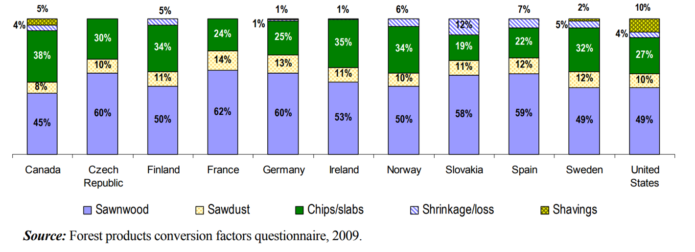
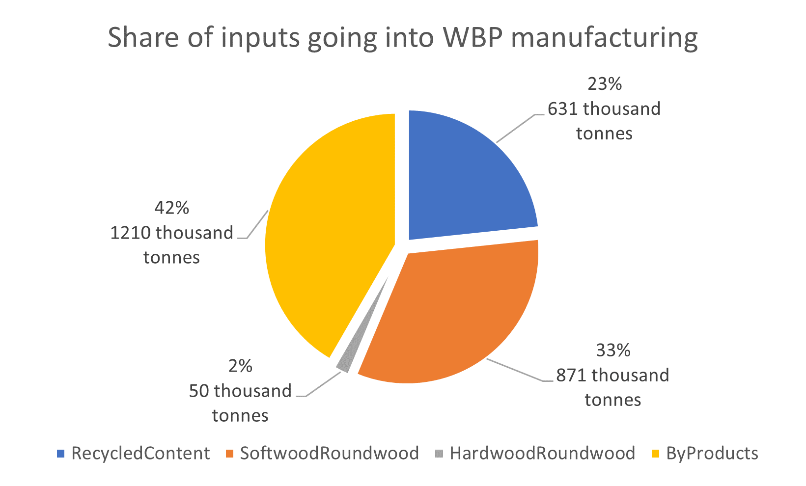
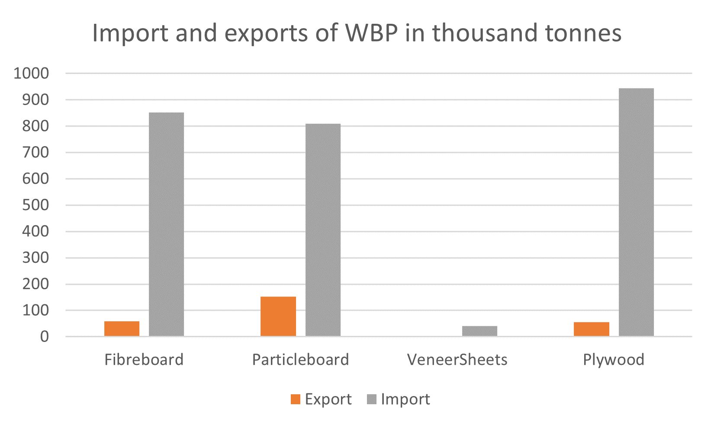
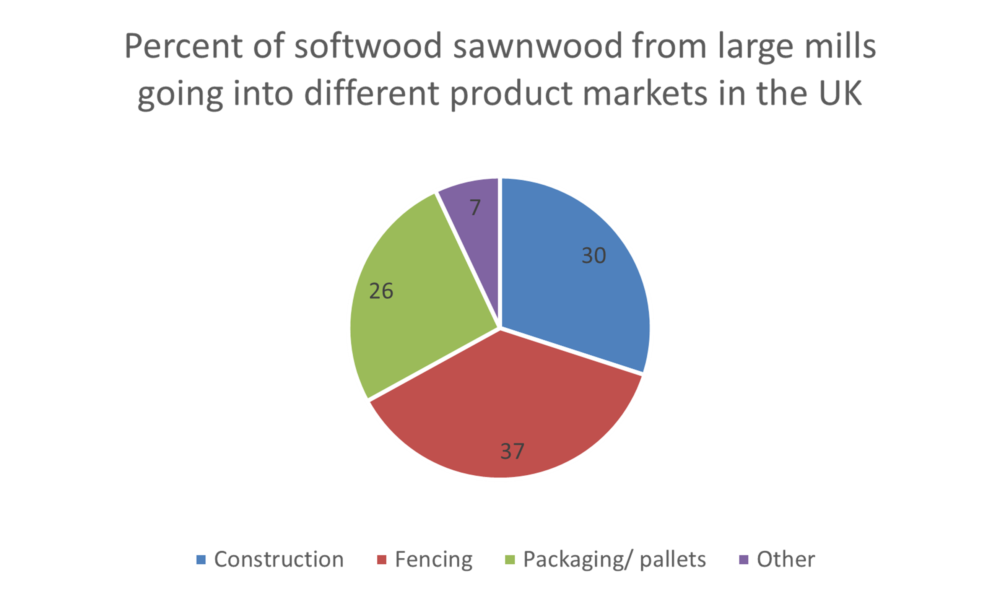
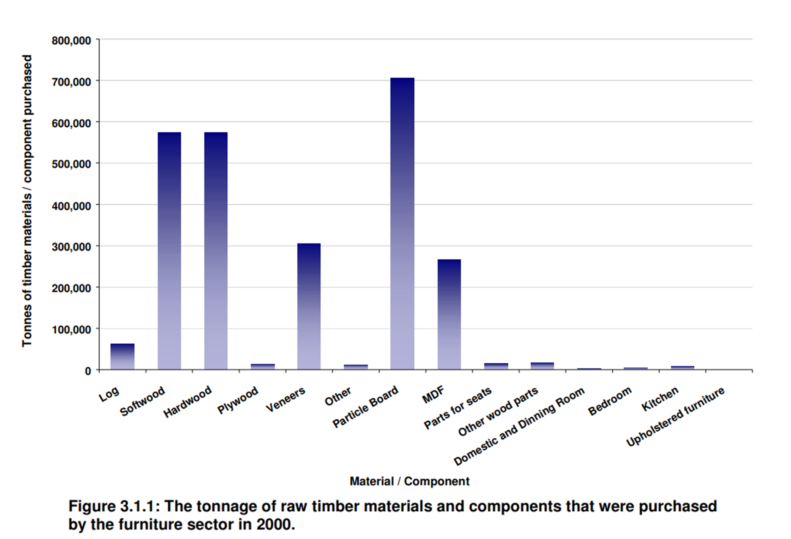

---
jupytext:
  text_representation:
    extension: .md
    format_name: myst
    format_version: 0.13
    jupytext_version: 1.13.8
kernelspec:
  display_name: Python 3 (ipykernel)
  language: python
  name: python3
---


# Recipes 

```{system:process} Wood
:label: Wood
:consumes: Roundwood RecycledWoodFibre RecycledPaper
:produces: CommercialProducts WoodFramesForNewStructures WoodRoofsForNewStructures WoodFloorFramingForNewStructures PreConsumerWasteProducts PreConsumerWasteProducts PaperProducts EnergyIndustry Construction 
:become_parent: true
```

```{system:process} HardwoodRoundwoodDelivery
---
label: Hardwood roundwood delivery 
consumes: |
      HardwoodRoundwood  = 0 kg
produces: |
      HardwoodRoundwood  = 1 kg
---
```

```{system:process} SoftwoodRoundwoodDelivery
---
label: Softwood roundwood delivery
consumes: |
      SoftwoodRoundwood  = 0 kg
produces: |
      SoftwoodRoundwood  = 1 kg
---
```

```{system:process} ForestResiduesDelivery
---
label: Forest residues delivery
consumes: |
      ForestResidues  = 0 kg
produces: |
      ForestResidues  = 1 kg
---
```

```{system:process} RecycledPaperDelivery    
---
label: Recycled paper delivery
consumes: |
      RecycledPaper  = 0 kg
produces: |
      RecycledPaper  = 1 kg
---
```

```{system:process} RecycledWoodFibreDelivery    
---
label: Recycled wood fibre delivery
consumes: |
      RecycledWoodFibre  = 0 kg
produces: |
      RecycledWoodFibre  = 1 kg
---
```


## Primary wood processing

```{system:process} PrimaryWoodProcessing
:label: Primary Wood Processing
:consumes: SoftwoodRoundwood HardwoodRoundwood ByProducts RecycledPaper WBPFibres
:produces: SoftwoodSawnwood HardwoodSawnwood Particleboard Fibreboard VeneerSheets Plywood PreConsumerWasteProducts WoodPelletsWoodFibres OtherEnergyFeedstocksWoodFibres Pulp RoundwoodToFencingAndOutdoor RecycledWoodFibreToPallets
:become_parent: true
```

  
### Sawmills

Sawmills are facilities where logs of roundwood are cut into lumber. The yield of sawmills is between 45-62% {cite}`UNECE`. Around half of the roundwood input leaves sawmills as by-products (chips, shavings and sawdust).



**Source**: {cite}`UNECE`

```{system:process} Sawmills
:label: Sawmills
:consumes: SoftwoodRoundwood HardwoodRoundwood
:produces: SoftwoodSawnwood HardwoodSawnwood ByProducts
:become_parent: true
```
```{system:process} SawmillsSoftwood
---
label: Sawmills Softwood
consumes: |
      SoftwoodRoundwood  = 1 kg
produces: |
      SoftwoodSawnwood = 0.5 kg
      ByProducts       = 0.5 kg
---
```

```{system:process} SawmillsHardwood
---
label: Sawmills Hardwood
consumes: |
      HardwoodRoundwood  = 1 kg
produces: |
      HardwoodSawnwood = 0.5 kg
      ByProducts       = 0.5 kg
---
```

```{end-sub-processes}
```


### Recycled wood to pallets

```{system:process} RecycledWoodFibreProcessingForPallets
---
label: Recycled fibres processing to pallets
consumes: |
      RecycledWoodFibre                 = 1 kg
produces: |
      RecycledWoodFibreToPallets        = 1  kg
---
```


### WBP manufacturing 

The wood fibres used for making wood-based panels come from small sections of roundwood, from sawmills in the form of wood chips and sawdust or from recovered wood from post-industrial (demolitions) or post-consumer sources {cite}`ForestResearchExcelTimber`. The share of these three raw materials in UK wood-based panel mills is taken from {cite}`ForestResearchExcelTimber`. The input of "other materials" designates binders and adhesives. The share of adhesives was taken from the Ecoinvent life-cycle database, for particleboard from the activity "particleboard production, uncoated, average glue mix, RER", for fibreboard from the activity "medium density fibreboard production, uncoated, RER", for plywood (18%) from the activity "plywood production, RER" {cite}`Ecoinvent`.

 



**Source**: {cite}`ForestResearchExcelTimber`

```{system:process} WBPmanufacturing
:label: WBP manufacturing
:consumes: SoftwoodRoundwood RecycledWoodFibre ByProducts
:produces: Particleboard Fibreboard PreConsumerWasteProducts Plywood VeneerSheets OtherEngineeredWoodProducts
:become_parent: true
``` 

```{system:process} FibreProductionForWBP
:label: Fibre production for WBP
:consumes: SoftwoodRoundwood RecycledWoodFibre ByProducts 
:produces: WBPFibres PreConsumerWasteProducts
:become_parent: true
```

```{system:process} WBPFibresSoftwoodRoundwood
---
label: Roundwood to WBP fibres
consumes: |
      SoftwoodRoundwood                = 1  kg
produces: |
      WBPFibres                        = 1  kg
---
```

```{system:process} WBPFibresByProducts
---
label: By-products to WBP fibres
consumes: |
      ByProducts                     = 1  kg
produces: |
      WBPFibres                      = 1  kg
---
```
```{system:process} WBPFibresRecycledWoodFibre
---
label: Recycled fibres to WBP fibres
consumes: |
      RecycledWoodFibre              = 1    kg
produces: |
      WBPFibres                      = 1    kg
---
```

```{end-sub-processes}
```


```{system:process} WBPBoardsProduction
:label: WBP boards production
:consumes: WBPFibres 
:produces: Particleboard Fibreboard PreConsumerWasteProducts Plywood VeneerSheets OtherEngineeredWoodProducts
:become_parent: true
```

```{system:process} FibreboardManufacturing
---
label: Fibreboard manufacturing 
consumes: |
      WBPFibres                        = 1 kg
produces: |
      Fibreboard                     = 0.9  kg
      PreConsumerWasteProducts       = 0.1  kg
---
```

```{system:process} ParticleboardManufacturing
---
label: Particleboard manufacturing 
consumes: |
      WBPFibres                      = 1    kg
produces: |
      Particleboard                  = 0.9  kg
      PreConsumerWasteProducts       = 0.1  kg
---
```
 
 
```{system:process} VeneerSheetsManufacturing
---
label: Veneer sheets manufacturing
consumes: |
      
produces: |
      VeneerSheets  = 1 kg    
                      
---
```

```{system:process} PlywoodManufacturing
---
label: Plywood manufacturing
consumes: |

produces: |
     Plywood =  1 kg                      
---
```


```{system:process} OtherEngineeredWoodProductsManufacturing
---
label: Other engineered wood products manufacturing
consumes: |

produces: |
     OtherEngineeredWoodProducts =  1 kg                      
---
```

```{end-sub-processes}
```

```{end-sub-processes}
```


## Pulpmills

A pulpmill is a manufacturing facility which processes pulpwood and wood chips into pulp which is further processed into paper products in papermills. Pulp can be manufactured using mechanical, semi-chemical, or fully chemical methods. The finished product may be either bleached or non-bleached. Recycled paper goes through a chemical treatment, is processed into pulp and is delivered into papermills. 
68% of pulpmills use fully chemical methods in Europe {cite}`Cepi`. The yield of pulpmills is taken from {cite}`EwijkStijn2018GLCP` and is calculated as a weighted average between the average yield of chemical (92.5%) and mechanical methods (47.5%). 

```{system:process} Pulpmills
:label: Pulpmills
:consumes: SoftwoodRoundwood RecycledPaper ByProducts  
:produces: Pulp PreConsumerWasteProducts RecycledPulp
:become_parent: true
```

```{system:process} NewPulpMaking
---
label: New pulp making
consumes: |
      SoftwoodRoundwood       = 1 kg
produces: |
      Pulp                     = 0.58 kg
      PreConsumerWasteProducts = 0.42 kg
---
```  

```{system:process} PulpmillsRecycledPaper
---
label: Pulpmills recycled paper

consumes: |
      RecycledPaper               = 1 kg
produces: |
      RecycledPulp                = 0.81  kg
      PreConsumerWasteProducts    = 0.19  kg
---
```

```{system:process} PulpmillsByProducts
---
label: Pulpmills by products
consumes: |
      ByProducts                = 1 kg
produces: |
      Pulp                     = 0.92 kg
      PreConsumerWasteProducts = 0.08 kg
---
```

```{end-sub-processes}
```


## Wood fibres to fuel production


Information on the quantity of wood pellets used in large OtherEnergyFeedstocks plants was taken from the following sources>
- <https://assets.publishing.service.gov.uk/government/uploads/system/uploads/attachment_data/file/490572/Woodfuel_Disclosure_Survey_2015.pdf>
- <https://www.ons.gov.uk/economy/environmentalaccounts/articles/aburningissuebiomassisthebiggestsourceofrenewableenergyconsumedintheuk/2019-08-30>
- <https://assets.publishing.service.gov.uk/government/uploads/system/uploads/attachment_data/file/462361/Trade_of_wood_pellets.pdf>

```{system:process} WoodFibresForEnergyProduction
:label: Energy
:consumes: HardwoodRoundwood SoftwoodRoundwood ByProducts RecycledWoodFibre PreConsumerWasteProducts ForestResidues
:produces: WoodPelletsWoodFibres OtherEnergyFeedstocksWoodFibres WoodCharcoal
:become_parent: true
```

```{system:process} WoodPelletsManufacturingSoftwoodRoundwood  
---
label: Softwood roundwood to wood pellets manufacturing 
consumes: |
      SoftwoodRoundwood                        = 1 kg
produces: |
      WoodPelletsWoodFibres                    = 1 kg
---
```

```{system:process} WoodPelletsManufacturingByProducts
---
label: By-products to wood pellets manufacturing 
consumes: |
      ByProducts                               = 1 kg
produces: |
      WoodPelletsWoodFibres                    = 1 kg
--- 
```


```{system:process} OtherEnergyFeedstocksSoftwoodRoundwood    
---
label: Softwood roundwood to other energy feedstocks
consumes: |
      SoftwoodRoundwood                        = 1 kg
produces: |
      OtherEnergyFeedstocksWoodFibres          = 1 kg
---
```

```{system:process} OtherEnergyFeedstocksHardwoodRoundwood
---
label: Hardwood roundwood to other energy feedstocks
consumes: |
      HardwoodRoundwood                        = 1 kg
produces: |
      OtherEnergyFeedstocksWoodFibres          = 1 kg
---
```

```{system:process} OtherEnergyFeedstocksByProducts
---
label: By products to other energy feedstocks
consumes: |
      ByProducts                               = 1 kg
produces: |
      OtherEnergyFeedstocksWoodFibres          = 1 kg
---
```

```{system:process} OtherEnergyFeedstocksPostConsumerWood
---
label: Post consumer wood to other energy feedstocks
consumes: |
      RecycledWoodFibre                         = 1 kg
produces: |
      OtherEnergyFeedstocksWoodFibres          = 1 kg
---
```

```{system:process} OtherEnergyFeedstocksForestResidues
---
label: Forest residues to other energy feedstocks
consumes: |
      ForestResidues                        = 1 kg
produces: |
      OtherEnergyFeedstocksWoodFibres          = 1 kg
---
```

```{system:process} WoodCharcoalProduction
---
label: Wood charcoal production
consumes: |
      SoftwoodRoundwood                        = 1 kg
produces: |
      WoodCharcoal          = 1 kg
---
```


```{end-sub-processes}
```

```{end-sub-processes} 
```


## The paper industry

Papermills transform paper pulp into paper products. Other materials designate fibrous materials used for paper production other than wood, their share in different paper products was taken from {cite}`EwijkStijn2018GLCP`.

```{system:process} Papermills
:label: Papermills
:consumes: Pulp RecycledPulp
:produces: GraphicPapers SanitaryPapers Packaging OtherPaperProducts
:become_parent: true
```

```{system:process} GraphicPapersManufacturing
---
label: Graphic papers manufacturing
consumes: |
      Pulp                        =  0.25  kg
      RecycledPulp                =  0.75 kg
produces: |
      GraphicPapers               = 1     kg
      
---
``` 

```{system:process} SanitaryPapersManufacturing
---
label: Sanitary papers manufacturing   
consumes: |
      Pulp                          =  0.66   kg
      RecycledPulp                  =  0.34  kg
produces: |
      SanitaryPapers               =  1   kg

---
``` 

```{system:process} PackagingManufacturing
---
label: Packaging manufacturing
consumes: |
      Pulp                          =  0.37  kg
      RecycledPulp                  =  0.63  kg
produces: |
      Packaging                     =  1    kg
---
```

```{system:process} OtherPaperProductsManufacturing
---
label: Other paper products manufacturing
consumes: |
      Pulp                          =  0.65 kg
      RecycledPulp                  =  0.35 kg
produces: |
      OtherPaperProducts            = 1    kg
---
```

```{end-sub-processes}
``` 


## The energy industry


```{system:process} EnergyIndustry
:label: Energy industry
:consumes: WoodPelletsWoodFibres OtherEnergyFeedstocksWoodFibres WoodCharcoal
:produces: WoodPellets OtherEnergyFeedstocks PreConsumerWasteProducts
:become_parent: true
```

```{system:process} WoodPelletsManufacturing
---
label: Wood pellets manufacturing 
consumes: |
      WoodPelletsWoodFibres                    = 1 kg
produces: |
      WoodPellets                              = 0.7 kg
      PreConsumerWasteProducts                 = 0.3 kg
---
```

```{system:process} OtherEnergyFeedstocksProduction
---
label: Other energy feedstocks production 
consumes: |
      OtherEnergyFeedstocksWoodFibres             = 1 kg
produces: |
      OtherEnergyFeedstocks                       = 1 kg
---
```

```{system:process} WoodCharcoalToOtherEnergyFeedstocks
---
label: Wood charcoal to other energy feedstocks 
consumes: |
      WoodCharcoal             = 1 kg
produces: |
      OtherEnergyFeedstocks                       = 1 kg
---
```

```{end-sub-processes}
```


```{system:process} ProductsManufacturing
:label: Products manufacturing
:consumes: SoftwoodRoundwood HardwoodRoundwood ByProducts SoftwoodSawnwood HardwoodSawnwood Particleboard Fibreboard VeneerSheets Plywood RecycledWoodFibreToPallets RoundwoodToFencingAndOutdoor
:produces: WoodenKitchenFurniture WoodenBedroomFurniture WoodenSeats WoodenOfficeFurniture FibreboardToRMIAndOther WoodenOtherFurniture PreConsumerWasteProducts ByProducts FencingPosts FencingRailsAndBoards  Pallets OtherWoodContainers RailwaySleepers FormworkScaffolding OtherObjects Windows Doors Flooring  PreConsumerWasteProducts SawnwoodToRMIAndOther ParticleboardToRMIAndOther  PlywoodToRMIAndOther RefurbishedPallets
:become_parent: true
```


## Products manufacturing



```{system:process} CommercialProductsManufacturing
:label: Commercial products 
:consumes: SoftwoodRoundwood HardwoodRoundwood SoftwoodSawnwood HardwoodSawnwood Particleboard Fibreboard VeneerSheets Plywood RecycledWoodFibre RecycledWoodFibreToPallets RoundwoodToFencingAndOutdoor
:produces: WoodenKitchenFurniture WoodenBedroomFurniture WoodenSeats WoodenOfficeFurniture FibreboardToRMIAndOther WoodenOtherFurniture PreConsumerWasteProducts ByProducts FencingPosts FencingRailsAndBoards Pallets OtherWoodContainers RailwaySleepers OtherObjects RefurbishedPallets
:become_parent: true
```

### FencingManufacturing
 
Fencing manufacturing includes the processing of roundwood into round fencing posts and the processing of sawnwood into fence panels, it also includes other outdoor products such as prefabricated buildings. 
The data on by-product output was collected by surveying round-fencing manufacturers in the UK by Forest Research {cite}`ForestResearchExcelTimber`. 
 


```{system:process} FencingAndOutdoorManufacturing
:label: Fencing manufacturing
:consumes:  SoftwoodRoundwood  SoftwoodSawnwood
:produces: FencingPosts PreConsumerWasteProducts FencingRailsAndBoards
:become_parent: true
```

```{system:process} SawnwoodToFencingAndOutdoorManufacturing
---
label: Sawnwood to fencing manufacturing 
consumes: |
      SoftwoodSawnwood                         = 1    kg
produces: |
      SawnwoodToFencingAndOutdoor              = 1    kg

---
```


```{system:process} RoundwoodToFencingAndOutdoorManufacturing
---
label: Roundwood to fencing manufacturing 
consumes: |
      SoftwoodRoundwood                             = 1  kg
produces: |
      RoundwoodToFencingAndOutdoor                  = 1  kg
--- 
```


```{system:process} FencingPostsManufacturing
---
label: Fencing posts manufacturing 
consumes: |
      RoundwoodToFencingAndOutdoor              = 1    kg
produces: |
      FencingPosts                             = 0.80 kg
      PreConsumerWasteProducts                 = 0.2  kg
---
```


 


```{system:process} FencingRailsAndBoardsManufacturing
---
label: Fencing rails and boards manufacturing
consumes: | 
      SawnwoodToFencingAndOutdoor                   = 1    kg
produces: |
      FencingRailsAndBoards                         = 0.80 kg
      PreConsumerWasteProducts                      = 0.2  kg
---
```


```{system:process} RailwaySleepersManufacturing
---
label: Railway sleepers manufacturing
consumes: |
      HardwoodSawnwood                    = 1    kg
produces: |
      RailwaySleepers                     = 1    kg

---
```
 
```{end-sub-processes} 
``` 

### Wood container manufacturing

This production process describes the manufacturing of industrial wood containers such as flat pallets, box pallets, crates, cable drums, cases, casks, boxes, barrels, vats and tubs.
Other materials designate the binder and the iron content (screws) of wood containers which is estimated to be around 5.1% {cite}`Thunen`. The yield of wood container manufacturing is 90% {cite}`SAAL2022100199`.


```{system:process} WoodenContainersManufacturing
---
label: Packaging manufacturing
consumes: SoftwoodSawnwood Particleboard Plywood HardwoodSawnwood ByProducts RecycledWoodFibreToPallets
produces: Pallets PreConsumerWasteProducts OtherWoodContainers RefurbishedPallets
become_parent: true
```

```{system:process} PalletsManufacturing
---
label: Pallets manufacturing
consumes: |
      SoftwoodSawnwood                    = 0.9   kg
      Plywood                       = 0.1  kg
produces: |
      Pallets                             = 0.9     kg 
      PreConsumerWasteProducts            = 0.1   kg
---
```  


```{system:process} RefurbishedPalletsManufacturing
---
label: Refurbished pallets manufacturing
consumes: |
      RecycledWoodFibreToPallets           = 0.9   kg
      SoftwoodSawnwood                    = 0.1   kg
produces: |
      RefurbishedPallets                 = 0.9     kg 
      PreConsumerWasteProducts            = 0.1   kg
---
``` 

```{system:process} OtherWoodContainersManufacturing
---
label: Other wood containers manufacturing
consumes: |
      SoftwoodSawnwood                    = 0.4    kg 
      HardwoodSawnwood                    = 0.1    kg
      Particleboard                       = 0.2   kg
      Plywood                             = 0.3    kg
produces: |
      OtherWoodContainers                  = 0.9    kg
      PreConsumerWasteProducts            = 0.1    kg
      
---  
```
 
```{end-sub-processes}
```

### Furniture 

This process describes the raw material inputs into furniture manufacturing. Furniture manufacturing designates the manufacturing of the wooden components of seats, office, shop, dining room, kitchen, bedroom furniture and furniture for non-domestic uses. The production inpus were taken from a 2002 report on the furniture industry and were expressed as shares {cite}`TradaFurniture`. An average of 15% of the raw material inputs leave as waste which are either incinerated or sent for recycling {cite}`TradaFurniture`. 

 
**Source**: TRADA Wood Used in Furniture: The UK Mass Balance and Efficiency of Use, 


```{system:process} FurnitureManufacturing
---
label: Furniture manufacturing
consumes: SoftwoodSawnwood Particleboard Plywood HardwoodSawnwood Fibreboard VeneerSheets
produces: WoodenOfficeFurniture WoodenBedroomFurniture  WoodenKitchenFurniture WoodenSeats WoodenOtherFurniture
become_parent: true
```
  
```{system:process} WoodenOfficeFurnitureManufacturing
---
label: Wooden office furniture manufacturing
consumes: |
      SoftwoodSawnwood                    = 0.23    kg
      HardwoodSawnwood                    = 0.13    kg
      Particleboard                       = 0.38    kg
      Fibreboard                          = 0.12    kg
      Plywood                             = 0.02    kg
      VeneerSheets                        = 0.12    kg
produces: |
      WoodenOfficeFurniture               = 0.75      kg
      PreConsumerWasteProducts            = 0.25    kg
---
```
  

```{system:process} WoodenBedroomFurnitureManufacturing
---
label: Wooden bedroom furniture manufacturing
consumes: |
      SoftwoodSawnwood                    = 0.23    kg
      HardwoodSawnwood                    = 0.13    kg
      Particleboard                       = 0.38    kg
      Fibreboard                          = 0.12    kg
      Plywood                             = 0.02    kg
      VeneerSheets                        = 0.12    kg
produces: |
      WoodenBedroomFurniture              = 0.75      kg
      PreConsumerWasteProducts            = 0.25    kg
---
``` 

```{system:process} WoodenKitchenFurnitureManufacturing
---
label: Wooden kitchen furniture manufacturing
consumes: |
      SoftwoodSawnwood                    = 0.23    kg 
      HardwoodSawnwood                    = 0.13    kg
      Particleboard                       = 0.38    kg
      Fibreboard                          = 0.12    kg
      Plywood                             = 0.02    kg
      VeneerSheets                        = 0.12    kg
produces: |
      WoodenKitchenFurniture              = 0.75      kg
      PreConsumerWasteProducts            = 0.25    kg
---
```

```{system:process} WoodenSeatsManufacturing
---
label: Wooden seats manufacturing
consumes: |
      SoftwoodSawnwood                    = 0.23    kg
      HardwoodSawnwood                    = 0.13    kg
      Particleboard                       = 0.38    kg
      Fibreboard                          = 0.12    kg
      Plywood                             = 0.02    kg
      VeneerSheets                        = 0.12    kg
produces: |
      WoodenSeats                         = 0.75    kg
      PreConsumerWasteProducts            = 0.25    kg
---
```

```{system:process} WoodenOtherFurnitureManufacturing
---
label: Wooden other furniture manufacturing
consumes: |
      SoftwoodSawnwood                    = 0.23    kg
      HardwoodSawnwood                    = 0.13    kg
      Particleboard                       = 0.38    kg
      Fibreboard                          = 0.12    kg
      Plywood                             = 0.02    kg
      VeneerSheets                        = 0.12    kg
produces: |
      WoodenOtherFurniture                = 0.75       kg
      PreConsumerWasteProducts            = 0.25    kg
---
```

```{end-sub-processes}
```


### OtherObjects

This process is an aggregate for all small commercial objects produced from wood. 

```{system:process} OtherProductsManufacturing
---
label: Other products manufacturing
consumes: SoftwoodSawnwood  SoftwoodRoundwood
produces: OtherObjects  WoodWoolAndFlour PreConsumerWasteProducts    
become_parent: true
```
  

```{system:process} OtherObjectsManufacturing
---
label: Oth. objects manufacturing
consumes: |
      SoftwoodSawnwood                    = 1   kg
produces: |
      OtherObjects                        = 0.8   kg
      PreConsumerWasteProducts            = 0.2   kg

---
```

```{system:process} WoodWoolAndFlourManufacturing
---
label: Wood wool and flour  manufacturing
consumes: |
      SoftwoodRoundwood                    = 1   kg
produces: |
      WoodWoolAndFlour                        = 1   kg

---
```

```{end-sub-processes}
```


```{end-sub-processes}
```


## The construction and joinery industries


`


## Repair Maintenance and Improvement 

Repair maintenance and improvement works are the routine works carried-out to a property to preserve its good condition and prevent deterioration. The 70% yield of wood-based repair, maintenance and improvement works was estimated using data from 2002 on the quantity of wood products imported and produced locally for the construction industry, the share of these wood products embodied into construction projects and the quantity of wood products leaving for recycling, re-use or final disposal {cite}`TradaConstruction`. 

```{system:process} WoodFibresProductionForRMI
:label: Wood fibres production for RMI
:consumes: Particleboard Plywood Fibreboard
:produces: PreConsumerWasteProducts ParticleboardToRMIAndOther  PlywoodToRMIAndOther  FibreboardToRMIAndOther
:become_parent: true
```


```{system:process} OtherEngineeredWoodProductsToConstruction
---
label:  Other engineered wood products to construction
consumes: |
      OtherEngineeredWoodProducts                   = 1    kg   
produces: |
      OtherEngineeredWoodProductsToCst                = 1 kg       
---
```

```{system:process} ParticleboardToRepairMaintenanceImprovement
---
label: Particleboard to RMI
consumes: |
      Particleboard                               = 1    kg   
produces: |
      ParticleboardToRMIAndOther                  = 0.9  kg       
      PreConsumerWasteProducts                = 0.1  kg
---
```

```{system:process} PlywoodToRepairMaintenanceImprovement
---
label: Plywood to RMI
consumes: | 
      Plywood                                      = 1    kg   
produces: |
      PlywoodToRMIAndOther                        = 0.9  kg       
      PreConsumerWasteProducts                = 0.1  kg
---
```


```{system:process} FibreboardToRepairMaintenanceImprovement
---
label: Fibreboard to RMI
consumes: |
      Fibreboard                                   = 1    kg   
produces: |
      FibreboardToRMIAndOther                      = 1  kg       
      PreConsumerWasteProducts                = 0  kg
---
```

```{end-sub-processes}   
```


```{system:process} SawnwoodToConstruction
---
label:  Sawnwood to construction
consumes: |
      SoftwoodSawnwood                             = 1    kg   
produces: |
      SawnProductsToCst                        = 1 kg       
---
```

## Sawn construction products manufacturing


```{system:process} SawnConstructionProductsManufacturing
:label: Sawn construction products manufacturing
:consumes: SoftwoodSawnwood
:produces: NewBuilds  PreConsumerWasteProducts SawnwoodToRMIAndOther FormworkScaffolding
:become_parent: true
```


### Formwork-Scaffolding

```{system:process} FormworkScaffoldingManufacturing
---
label: FormworkScaffolding manufacturing
consumes: | 
      SoftwoodSawnwood                    = 1   kg
produces: | 
      FormworkScaffolding                 = 1     kg
  
--- 
```


```{system:process} SawnwoodToRepairMaintenanceImprovement
---
label:  Sawnwood to RMI
consumes: |
      SoftwoodSawnwood                           = 1    kg   
produces: |
      SawnwoodToRMIAndOther                       = 0.9 kg 
      PreConsumerWasteProducts                = 0.1  kg      
---
```

### Building elements manufacturing

These processes describe the construction of WoodRoofsForNewStructures , floor and frame WoodStructures for new residential houses. They include structural elements (post and beams, noggings) and cellular wood panels used for floor boards and sheathing. WoodFramesForNewStructures are modelled as an open panel system consisting of horizontal softwood beams and softwood structural noggins weighting 14.3 kg per square meter of frame and of a OSB/plywood sheathing weighting 13.3 kg per sqaure meter of frame {cite}`WoodForGoodOpenPanel`. WoodRoofsForNewStructures s are modelled with timber trusses weighting 19 kg per meter square of WoodRoofsForNewStructures  {cite}`WoodRoofsForNewStructures AllanCormackJoiners`. The floor structure is modelled with beams weighting 13.2 kg per meter sqaure of floor (47x175 mm every 400mm) and of 10 kg per meter square particleboard or plywood foor boards {cite}`DrewniokMichałP.2023Mtec`.  


```{system:process} BuildingElementsManufacturing
---
label: Building elements manufacturing
consumes: SawnwoodToCst  
produces: NewBuilds PreConsumerWasteProducts
become_parent: true
```


```{system:process} WoodFramesForNewStructuresManufacturing
---
label: WoodFramesForNewStructures manufacturing
consumes: |
      SoftwoodSawnwood                    = 29  kg
produces: |
      WoodFramesForNewStructures          = 1     m2
      PreConsumerWasteProducts        = 2.9   kg
---.
```


```{system:process} WoodRoofsForNewStructuresManufacturing
---
label: WoodRoofsForNewStructures manufacturing
consumes: |
      SoftwoodSawnwood                    = 38  kg
produces: |
      WoodRoofsForNewStructures          = 1     m2
      PreConsumerWasteProducts        = 3.8   kg
---.
```


 
```{system:process} WoodFloorFramingForNewStructuresManufacturing
---
label: Upper floors manufacturing
consumes: |
      SoftwoodSawnwood                   = 42  kg
produces: |
      WoodFloorFramingForNewStructures    = 1    m2
      PreConsumerWasteProducts        = 4.2   kg
--- 
```
 


### Residential houses

The use of wood-based products in residential houses by typology is based on the following equation:

Softwood sawnwood <sub>k=1</sub> = Σ<sub>j</sub> ρ<sub>jk</sub> Σ<sub>i</sub> β<sub>ij</sub> * γ<sub>ij</sub> * D * α<sub>i</sub> * A<sub>i</sub>

*Where*:
- *D* is the number of new builds in 2019. It is estimated that 210 690 new houses were built in 2019. This value is used in this study. 
- *α* is the share of typologies among the total number of new builds (ex: 17% of the total new builds are end-terraces)
- *A* is the avearge floor area by typology
- *ρ* is the mass of the sawnwood or wood-based panel per square meter of the component (ex: 14.6 kg of timber per wall area for WoodFramesForNewStructures)
- *γ* is the area of each component per floor area. 
- *β* is the share of houses which have their WoodRoofsForNewStructures , floor or frame constructed out of wood-based products (ex: 20% of end-terraces have a timber frame)

- j designates the component type
- k designates the studies materials (ie. softwood sawnwood)
- i designated the house type

Data on the share of typologies in the total number of new-builds constructed in 2019 in the UK can be found in {cite}`EnglishHousingSurvey`. Information on the share of newly-built houses which have their WoodRoofsForNewStructures , floor or frame constructed out of wood-based products is taken from {cite}`DrewniokMichałP.2023Mtec`. 


```{system:process} HousesConstruction
label: Houses construction
consumes: WoodFramesForNewStructures WoodFloorFramingForNewStructures WoodRoofsForNewStructures  WoodFramesForNewStructuresParticleboard WoodFloorFramingForNewStructuresPlywood
produces: EndTerracedHouses MidTerracedHouses SemiDetachedHouses DetachedHouses Bungalows FlatLowRise ConvertedFlats 
become_parent: true

```
 
```{system:process} EndTerracedHousesConstruction
---
label: End-terraced houses
defs: |
      WoodFramesForNewStructures_to_endterraced_ratio      = 0.2 
      WoodFloorFramingForNewStructures_to_endterraced_ratio = 0.6 
      WoodRoofsForNewStructures_to_endterraced_ratio        = 0.6 

      wall_to_floor_ratio        = 1.4
      upperfloor_to_floor_ratio  = 0.6
      roof_to_floor_ratio        = 0.6
consumes: |
      {object: WoodFramesForNewStructures, amount: 1.4 * WoodFramesForNewStructures_to_endterraced_ratio, unit: m2}
      {object: WoodFloorFramingForNewStructures, amount: 0.6 * WoodFloorFramingForNewStructures_to_endterraced_ratio, unit: m2}
      {object: WoodRoofsForNewStructures , amount: 0.6* WoodRoofsForNewStructures_to_endterraced_ratio, unit: m2 }
produces: |
      EndTerracedHouses                 = 1 m2
---
```

```{system:process} MidTerracedHousesConstruction
---
label: Mid Terraced Houses Construction
defs: |
      WoodFramesForNewStructures_to_midterraced_ratio           = 0.2
      WoodFloorFramingForNewStructures_to_midterraced_ratio      = 0.6
      WoodRoofsForNewStructures_to_midterraced_ratio             = 0.6

      wall_to_floor_ratio        = 1.4
      upperfloor_to_floor_ratio  = 0.6
      WoodRoofsForNewStructures_to_floor_ratio   = 0.6
consumes: |
      {object: WoodFramesForNewStructures, amount: 1.4 * WoodFramesForNewStructures_to_midterraced_ratio, unit: m2}
      {object: WoodFloorFramingForNewStructures, amount: 0.6 * WoodFloorFramingForNewStructures_to_midterraced_ratio, unit: m2}
      {object: WoodRoofsForNewStructures , amount: 0.6 * WoodRoofsForNewStructures_to_midterraced_ratio, unit: m2 }
produces: |
      MidTerracedHouses                    = 1 m2
---
``` 

```{system:process} SemiDetachedHousesConstruction
---
label: Semi Detached Houses Construction
defs: |
      WoodFramesForNewStructures_to_semidetached_ratio      = 0.2
      WoodFloorFramingForNewStructures_to_semidetached_ratio = 0.6
      WoodRoofsForNewStructures_to_semidetached_ratio        = 0.6

      wall_to_floor_ratio        = 1.4
      upperfloor_to_floor_ratio  = 0.6
      WoodRoofsForNewStructures_to_floor_ratio        = 0.6
consumes: |
      {object: WoodFramesForNewStructures, amount: 1.4 * WoodFramesForNewStructures_to_semidetached_ratio, unit: m2}
      {object: WoodFloorFramingForNewStructures, amount: 0.6 * WoodFloorFramingForNewStructures_to_semidetached_ratio, unit: m2}
      {object: WoodRoofsForNewStructures , amount: 0.6 * WoodRoofsForNewStructures_to_semidetached_ratio, unit: m2 }
produces: |
      SemiDetachedHouses                 = 1 m2
---
```

```{system:process} DetachedHousesConstruction
---
label: Detached Houses Construction
defs: |
      WoodFramesForNewStructures_to_detached_ratio      = 0.2
      WoodFloorFramingForNewStructures_to_detached_ratio = 0.6
      WoodRoofsForNewStructures_to_detached_ratio        = 0.6

      wall_to_floor_ratio        = 1.4
      upperfloor_to_floor_ratio  = 0.6
      WoodRoofsForNewStructures_to_floor_ratio        = 0.6
consumes: |
      {object: WoodFramesForNewStructures, amount: 1.4 * WoodFramesForNewStructures_to_detached_ratio, unit: m2}
      {object: WoodFloorFramingForNewStructures, amount: 0.6 * WoodFloorFramingForNewStructures_to_detached_ratio, unit: m2}      
      {object: WoodRoofsForNewStructures , amount: 0.6 * WoodRoofsForNewStructures_to_detached_ratio, unit: m2 }
produces: |
      DetachedHouses                      = 1 m2
---
```

```{system:process} BungalowsConstruction
---
label: Bungalows Construction 
defs: |
      WoodFramesForNewStructures_to_bungalows_ratio      = 0.2
      WoodFloorFramingForNewStructures_to_bungalows_ratio = 0.6
      WoodRoofsForNewStructures_to_bungalows_ratio        = 0.6

      wall_to_floor_ratio        = 1.4
      upperfloor_to_floor_ratio  = 0.6
      WoodRoofsForNewStructures_to_floor_ratio        = 0.6
consumes: |
      {object: WoodFramesForNewStructures, amount: 1.4 * WoodFramesForNewStructures_to_bungalows_ratio, unit: m2}
      {object: WoodFloorFramingForNewStructures, amount: 0.6 * WoodFloorFramingForNewStructures_to_bungalows_ratio, unit: m2}
      {object: WoodRoofsForNewStructures , amount: 0.6 * WoodRoofsForNewStructures_to_bungalows_ratio, unit: m2 }
produces: |
      Bungalows                            = 1 m2
---
```
 
```{system:process} ConvertedFlatsConstruction
---
label: Converted Flats Construction 
defs: |
      WoodFramesForNewStructures_to_convertedflats_ratio      = 0
      WoodFloorFramingForNewStructures_to_convertedflats_ratio = 0
      WoodRoofsForNewStructures_to_convertedflats_ratio        = 0

      wall_to_floor_ratio        = 1.4
      upperfloor_to_floor_ratio  = 0.5
      WoodRoofsForNewStructures_to_floor_ratio        = 0.5
consumes: |
      {object: WoodFramesForNewStructures, amount: 0 * WoodFramesForNewStructures_to_convertedflats_ratio, unit: m2}
      {object: WoodFloorFramingForNewStructures, amount: 0 * WoodFloorFramingForNewStructures_to_convertedflats_ratio, unit: m2}
      {object: WoodRoofsForNewStructures , amount: 0 * WoodRoofsForNewStructures_to_convertedflats_ratio, unit: m2}
produces: | 
      ConvertedFlats                         = 1 m2
---
``` 

```{system:process} FlatLowRiseConstruction
---
label: Flat low rise Construction 
defs: |
      WoodFramesForNewStructures_to_flatlowrise_ratio      = 0
      WoodFloorFramingForNewStructures_to_flatlowrise_ratio = 0.2
      WoodRoofsForNewStructures_to_flatlowrise_ratio        = 0.2

      wall_to_floor_ratio        = 1.4
      upperfloor_to_floor_ratio  = 0.6
      WoodRoofsForNewStructures_to_floor_ratio        = 0.6
consumes: | 
      {object: WoodFramesForNewStructures, amount: 0 * WoodFramesForNewStructures_to_flatlowrise_ratio, unit: m2}
      {object: WoodFloorFramingForNewStructures, amount: 0.6* WoodFloorFramingForNewStructures_to_flatlowrise_ratio, unit: m2}
      {object: WoodRoofsForNewStructures , amount: 0.6 * WoodRoofsForNewStructures_to_flatlowrise_ratio, unit: m2}
produces: |
      FlatLowRise                           = 1 m2
---
```
 

```{end-sub-processes}
```


```{system:process} NewBuildsConstruction
---
label: New builds construction
consumes: EndTerracedHouses MidTerracedHouses SemiDetachedHouses DetachedHouses Bungalows FlatLowRise ConvertedFlats 
produces: NewBuilds 
become_parent: true
```

```{system:process} HousesToNewBuilds
---
label: Wood Structures To NewBuilds
consumes: |
      EndTerracedHouses     = 0.09  m2
      MidTerracedHouses     = 0.15  m2
      SemiDetachedHouses    = 0.27 m2
      DetachedHouses        = 0.2 m2
      Bungalows             = 0.02 m2
      ConvertedFlats        = 0.02 m2
      FlatLowRise           = 0.23 m2
produces: |
      NewBuilds             = 1 m2
---
```


```{end-sub-processes}
```


```{end-sub-processes}
```
 


## Joinery manufacturing

Joinery manufavturing is comprised of doors, windows, their WoodFramesForNewStructures and thresholds manufacturing processes and flooring. Each raw material input for door manufacturing was calculated as a share of the total wood fibre inputs in the Ecoinvent life-cycle production activity "door production, inner, wood, RER" {cite}`Ecoinvent`. The British Woodworking Federation estimates a low yield in joinery manufacturing of around 50%. This low yield can be explained by procurement practices and availability of raw materials: joinery manufacturers procur larger than necessary sections of timber which they then have to cut to size {cite}`JoineryWasteYield`.

```{system:process} JoineryManufacturing
:label: Joinery manufacturing
:consumes: SoftwoodSawnwood Particleboard Fibreboard VeneerSheets HardwoodSawnwood
:produces: Windows Doors Flooring PreConsumerWasteProducts 
:become_parent: true
```  


```{system:process} WindowsManufacturing
---
label: Windows manufacturing
consumes: |
   SoftwoodSawnwood                        = 1     kg
produces: |
      Windows                             = 0.5   kg
      PreConsumerWasteProducts            = 0.5   kg
---  
``` 
 
```{system:process} DoorsManufacturing
---
label: Doors manufacturing
consumes: | 
      SoftwoodSawnwood                    = 0.37   kg
      Fibreboard                          = 0.3    kg
      Particleboard                       = 0.3    kg
      VeneerSheets                        = 0.03   kg 

produces: |
      Doors                               = 0.5 kg
      PreConsumerWasteProducts               = 0.5 kg
---
``` 

```{system:process} FlooringManufacturing
---
label: Flooring manufacturing
consumes: |
      SoftwoodSawnwood                   = 1   kg
produces: |
      Flooring                           = 0.5   kg
      PreConsumerWasteProducts              = 0.5   kg
---
```

```{end-sub-processes}
```

```{end-sub-processes}
```


```{end-sub-processes}
```


```{system:process} CommercialProductsConsumption
---
 label: Commercial products consumption
 consumes: Furniture Pallets OtherObjects OtherWoodContainers RailwaySleepers FormworkScaffolding FencingPosts FencingRailsAndBoards Decking WoodenOutbuildings RefurbishedPallets OtherWoodContainers SawnwoodToRMIAndOther  ParticleboardToRMIAndOther  PlywoodToRMIAndOther  FibreboardToRMIAndOther OtherEngineeredWoodProductsToCst Doors Windows Flooring NewBuilds
 produces: 
 become_parent: true
```

```{system:process}  WoodenOfficeFurnitureConsumption    
---
label:  Wooden Office Furniture consumption
consumes: |
      WoodenOfficeFurniture  = 1 kg
produces: |
      
---
```

```{system:process}  WoodenKitchenFurnitureConsumption    
---
label:  Wooden Kitchen Furniture consumption
consumes: |
      WoodenKitchenFurniture  = 1 kg
produces: |
      
---
```

```{system:process} WoodenBedroomFurnitureConsumption
---
label: Wooden Bedroom Furniture consumption
consumes: |
      WoodenBedroomFurniture  = 1 kg
produces: |
      
---
```

```{system:process} WoodenOtherFurnitureConsumption
---
label: Wooden Other Furniture consumption
consumes: |
      WoodenOtherFurniture  = 1  kg
produces: |
     
---
```

```{system:process} WoodenSeatsConsumption
---
label: Wooden Seats consumption
consumes: |
      WoodenSeats  = 1  kg
produces: |
      
---
```

```{system:process} PalletsConsumption
---
label: Flat and Box Pallets consumption
consumes: |
      Pallets  = 1 kg
produces: |
      
---
```

```{system:process} FencingPostsConsumption
---
label: Fencing posts consumption
consumes: |
      FencingPosts  = 1 kg
produces: |
      
---
```

```{system:process} FibreboardToRMIAndOtherConsumption
---
label:  FibreboardToRMIAndOther consumption
consumes: |
      FibreboardToRMIAndOther  = 1 kg
produces: |
      
---
```

```{system:process} WoodenOutbuildingsConsumption
---
label: Prefabricated wooden buildings consumption
consumes: |
      WoodenOutbuildings  = 1 kg
produces: |

---
```

```{system:process} FencingRailsAndBoardsConsumption
---
label: Fencing rails and boards consumption
consumes: |
      FencingRailsAndBoards  = 1 kg
produces: |
      
---
```

```{system:process} DeckingConsumption
---
label: Decking consumption
consumes: |
      Decking  = 1 -
produces: |
---
```


```{system:process} OtherObjectsConsumption
---
label:  Other objects consumption
consumes: |
      OtherObjects  = 1 kg
produces: |
      
--- 
```
 
```{system:process} OtherWoodContainersConsumption
---
label:  Other wood containers consumption
consumes: |
      OtherWoodContainers  = 1 kg
produces: |
      
---
```  


 
```{system:process} RefurbishedPalletsConsumption
---
label: Refurbished pallets consumption
consumes: |
      RefurbishedPallets  = 1 kg
produces: |
      
---
```

```{system:process} RailwaySleepersConsumption
---
label:  Railway sleepers consumption
consumes: |
      RailwaySleepers  = 1 kg
produces: |
      
---
```

```{system:process} FormworkScaffoldingConsumption
---
label:  Formwork scaffolding consumption
consumes: |
      FormworkScaffolding  = 1 kg
produces: |
      
---
```


```{system:process} SawnwoodToRMIAndOtherConsumption
---
label:  SawnwoodToRMIAndOther consumption
consumes: |
      SawnwoodToRMIAndOther  = 1 kg
produces: |
      
---
```


```{system:process} OtherEngineeredWoodProductsConsumption
---
label:  OtherEngineeredWoodProducts consumption
consumes: |
      OtherEngineeredWoodProductsToCst  = 1 kg
produces: |
      
---
```

```{system:process} ParticleboardToRMIAndOtherConsumption
---
label:  ParticleboardToRMIAndOther consumption
consumes: |
      ParticleboardToRMIAndOther  = 1 kg
produces: |
      
---
```


```{system:process} PlywoodToRMIAndOtherConsumption
---
label:  PlywoodToRMIAndOther consumption
consumes: |
      PlywoodToRMIAndOther  = 1 kg
produces: |
      
---
```


```{system:process} FlooringConsumption
---
label: Flooring consumption
consumes: |
      Flooring  = 1 kg
produces: |
      
---
```

```{system:process} WindowsConsumption
---
label:  Windows consumption
consumes: |
      Windows  = 1 kg
produces: |
      
---
```

```{system:process} DoorsConsumption
---
label: Doors consumption
consumes: |
      Doors  = 1  kg
produces: |
      

---
```
```{system:process} NewBuildsConsumption
---
label:  NewBuilds consumption
consumes: |
      NewBuilds  = 1 m2
produces: |
      
---
```

```{system:process} WoodWoolAndFlourConsumption
---
label:  Wood wool and flour consumption
consumes: |
      WoodWoolAndFlour  = 1 kg
produces: |
       
      
---
```


```{system:process} WoodFramesForNewStructuresConsumption
---
label:  WoodFramesForNewStructures consumption
consumes: |
      WoodFramesForNewStructures  = 1 m2
produces: |
     
---
```

```{system:process} WoodRoofsForNewStructuresConsumption
---
label:  WoodRoofsForNewStructures  consumption
consumes: |
      WoodRoofsForNewStructures   = 1 m2
produces: |
      
---
```

```{system:process} WoodFloorFramingForNewStructuresConsumption
---
label:  WoodFloorFramingForNewStructures consumption
consumes: |
      WoodFloorFramingForNewStructures  = 1 m2
produces: |
      
---
```


```{system:process} InUseProductsLeave
---
label:  In use products leave
consumes: |
      InUseProducts  = 1 kg
produces: |
      RecycledWoodFibre = 0.18 kg

---
```


```{end-sub-processes}
```

 ```{system:process} EnergyConsumption
 ---
 label: Energy consumption
 consumes: OtherEnergyFeedstocks WoodPellets  
 produces: 
 become_parent: true 
```

```{system:process} OtherEnergyFeedstocksConsumption
---
label:  Other energy feedstocks consumption
consumes: |
      OtherEnergyFeedstocks  = 1 kg
produces: |
      OtherEnergyFeedstocks = 0 kg
---
```

```{system:process} WoodPelletsConsumption
---
label:  Wood pellets consumption
consumes: |
      WoodPellets  = 1 kg
produces: |
      WoodPellets = 0 kg
---
```

```{end-sub-processes}
```


```{system:process} PreConsumerWasteProductsConsumption
---
label:  Pre consumer waste products consumption
consumes: |
      PreConsumerWasteProducts  = 1 kg
produces: |
      
---
```


 ```{system:process} PaperProductsConsumption
 ---
 label: Paper products consumption
 consumes: GraphicPapers SanitaryPapers Packaging OtherPaperProducts
 produces: 
 become_parent: true
```


```{system:process} GraphicPapersConsumption
---
label:  Graphic papers consumption
consumes: |
      GraphicPapers  = 1 kg
produces: |
      
---
```

```{system:process} SanitaryPapersConsumption
---
label:  Sanitary papers consumption
consumes: |
      SanitaryPapers  = 1 kg
produces: |
      
---
```

```{system:process} PackagingConsumption
---
label:  Packaging consumption
consumes: |
      Packaging = 1 kg
produces: |
     
---
```

```{system:process} OtherPaperProductsConsumption
---
label:  Other paper products consumption
consumes: |
      OtherPaperProducts  = 1 kg
produces: |
      
---
```


```{system:process} InUseLeave
---
label:  In use leave
consumes: |
      InUse  = 1 kg
produces: |
      RecycledPaper = 0.65 kg

---
```

```{end-sub-processes}
```


```{end-sub-processes}
```
